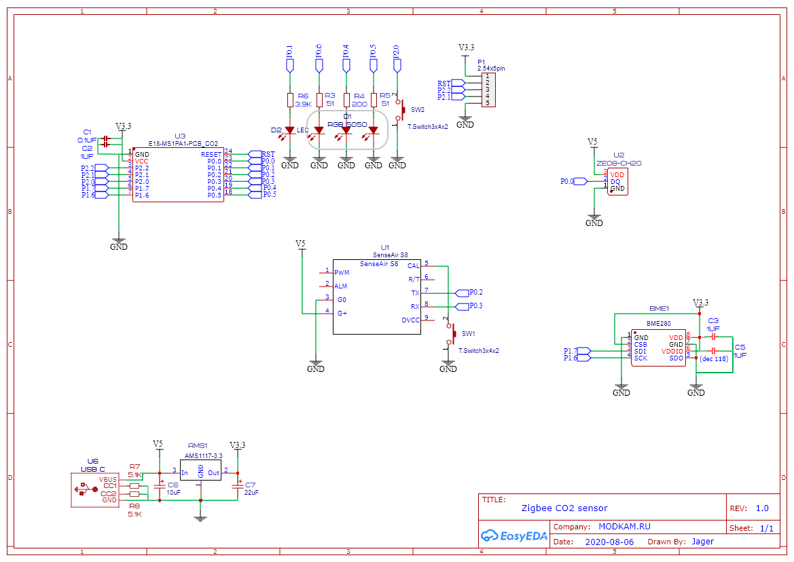
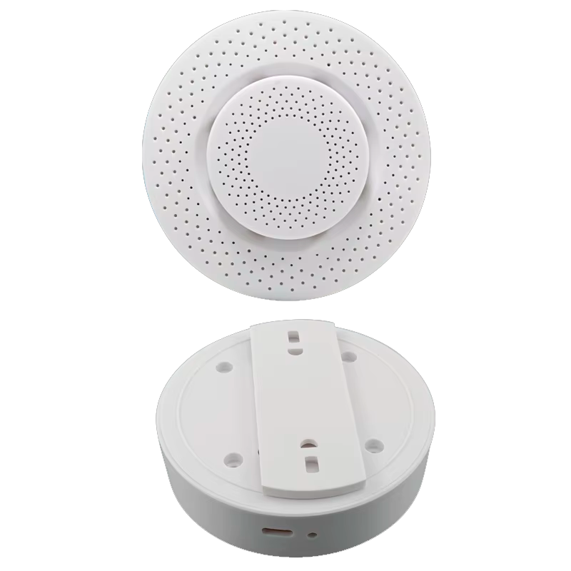
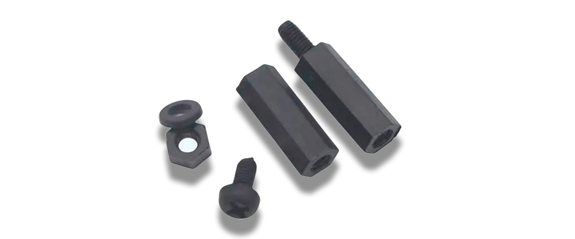
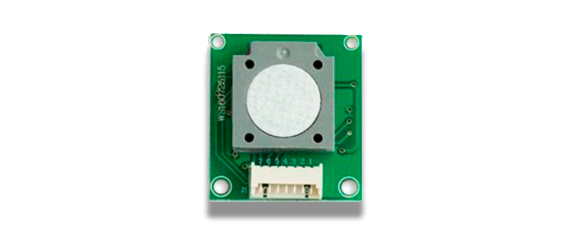

# DIYRUZ AirSense Reloaded

# DIYRUZ AirSens Reloaded

Zigbee 3.0 датчик мониторинга качества воздуха на базе SenseAir S8 (CO2), BME280 (температура, влажность, давление) и опционально ZE08K-CH2O (формальдегид).

**Проект является форком/переработкой** [оригинального AirSense](https://github.com/diyruz/AirSense)

---

## Содержание

1. [Отличия от оригинального AirSense](#отличия-от-оригинального-airsense)
2. [Сенсоры](#сенсоры)
3. [Технические характеристики](#технические-характеристики)
4. [Схема](#схема)
5. [Корпус](#корпус)
6. [Подключение к Zigbee сети](#подключение-к-zigbee-сети)
7. [Поддерживаемые платформы](#поддерживаемые-платформы)
8. [Zigbee кластеры и атрибуты](#zigbee-кластеры-и-атрибуты)
   - [Сенсоры (только чтение)](#сенсоры-только-чтение)
   - [Конфигурация (чтение/запись)](#конфигурация-чтениезапись)
9. [Идентификация устройства](#идентификация-устройства)
10. [Предупреждение](#предупреждение)

---

## Отличия от оригинального AirSense

| Аспект | Оригинальный AirSense | AirSens Reloaded |
|--------|----------------------|------------------|
| Плата | Исходная | Переработанная компоновка |
| Корпус | Самодельный | Заводской (AP07B-2) |
| Опрос SenseAir S8 | Нестабильный | Стабильный |
| Учет давления при расчете CO2 | Нет | Да |
| Управление RGB | Дискретное | ШИМ |
| Погрешность T/H от нагрева | Присутствует | Устранена |
| Датчик формальдегида | Нет | Опционально (ZE08K-CH2O) |
| Идентификация устройства | Нет | Есть |

Обратная совместимость со старым железом — сохранена.

---

## Сенсоры

| Сенсор | Измеряемые величины | Интерфейс | Документация |
|--------|--------------------|-----------|---------------|
| SenseAir S8 | CO2 (400-5000 ppm) | UART | [PSP107.pdf](DOC/PSP107.pdf) |
| Bosch BME280 | Температура, влажность, давление | I2C | [bst-bme280-ds002.pdf](DOC/bst-bme280-ds002.pdf) |
| Winsen ZE08K-CH2O | Формальдегид (HCHO) | DAC | [ze08k-ch2o.pdf](DOC/ze08k-ch2o.pdf) |

---

## Технические характеристики

| Параметр | Значение |
|----------|----------|
| Модель | DIYRUZ AirSens Reloaded |
| Протокол | Zigbee 3.0 |
| Радиомодуль | EBYTE E18-MS1PA1-IPEX (20 dBm) |
| Индикация | RGB LED 5050 (управление ШИМ) |
| Размеры корпуса | ⌀ 9 см × 2 см |
| Питание | USB Type C (поддержка быстрой зарядки) |

---

## Схема

---

## Корпус

Совместимый корпус: **AP07B-2**

| Сборка | Монтаж платы |
|--------|-------------|
|  | .png) |

Крепление модуля формальдегида — стойками M2.

| Установка датчика формальдегида |
|-------------------------------|
|  |
|  |

---

## Подключение к Zigbee сети

### Вход в сеть (Join)
1. Включить режим добавления устройств в Zigbee координаторе
2. Зажать и удерживать кнопку на датчике (рядом с USB)
3. Дождаться загорания системного светодиода
4. Светодиод погаснет через 5-7 секунд — начат поиск сети
5. При успехе — устройство добавлено
6. При неудаче через 15 секунд — повторить попытку

### Сброс и выход из сети
- Зажать кнопку на **10 секунд**
- Системный светодиод начнет мигать с частотой 1 Гц
- После прекращения мигания — кнопку отпустить
- Настройки в памяти устройства будут стерты

Альтернативный способ: удалить устройство через интерфейс координатора.

### Рекомендации при проблемах с подключением
На время добавления разместить устройство в 1-3 метрах от координатора или роутера с хорошим сигналом.

---

## Поддерживаемые платформы

- Zigbee2MQTT
- ZHA (Home Assistant)
- Спрут Хаб
- HOMEd

| Платформа | Скриншот |
|-----------|----------|
| Zigbee2MQTT | .png) |
| ZHA | .png) |
| Спрут Хаб | .png) |
| HOMEd | .png) |

---

## Zigbee кластеры и атрибуты

### Сенсоры (только чтение)

| Атрибут | Тип | Описание |
|---------|-----|----------|
| `co2` | uint16 | CO2, ppm |
| `formaldehyde` | uint16 | HCHO, мкг/м³ |
| `temperature` | int16 | °C × 100 |
| `humidity` | uint16 | % × 100 |
| `pressure` | uint16 | гПа |

.png)

### Конфигурация (чтение/запись)

| Атрибут | Тип | Описание | Диапазон |
|---------|-----|----------|----------|
| `co2_accurate_measurement` | bool | Учет атмосферного давления при расчете CO2 | 0/1 |
| `co2_automatic_calibration` | bool | Автокалибровка сенсора CO2 | 0/1 |
| `led_indication` | bool | Включение RGB индикации | 0/1 |
| `co2_moderate_threshold` | uint16 | Порог "умеренно" для LED | 400-5000 |
| `co2_hazardous_threshold` | uint16 | Порог "опасно" для LED | 400-5000 |
| `formaldehyde_moderate_threshold` | uint16 | Порог "умеренно" для LED (HCHO) | 0-2000 |
| `formaldehyde_hazardous_threshold` | uint16 | Порог "опасно" для LED (HCHO) | 0-2000 |
| `temperature_offset` | int16 | Коррекция температуры | - |
| `humidity_offset` | int16 | Коррекция влажности | - |
| `pressure_offset` | int16 | Коррекция давления | - |
| `formaldehyde_offset` | int16 | Коррекция формальдегида | - |

---

## Идентификация устройства

| Поле | Значение |
|------|----------|
| Команда | `identify` (Zigbee кластер 0x0003) |
| Поведение | RGB индикатор плавно мигает |

---

## Предупреждение

> **Датчик НЕ предназначен для систем безопасности.**
>
> Запрещено использовать:
> - в системах аварийной вентиляции
> - в пожарных сигнализациях
> - для измерения абсолютных концентраций токсичности
>
> **Назначение:** мониторинг качества воздуха в неответственных применениях.

---

## Ссылки

- [Проект на GitHub](https://github.com/smartboxchannel/AirSense_Reloaded)
- [Telegram группа DIY DEV](https://t.me/diy_devices)
- [DIY Барахолка](https://t.me/diydevmart)
- [Каталог устройств EFEKTA](http://efektalab.com/Efekta_devices)

---

## Лицензия

Open source.
